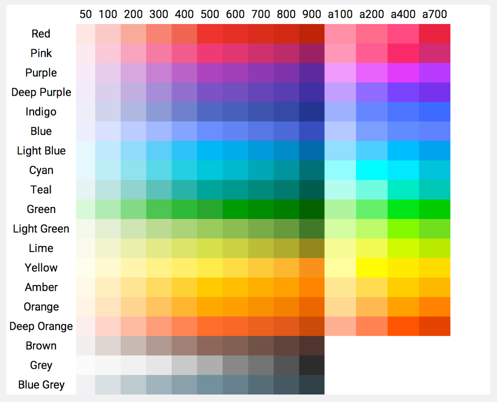
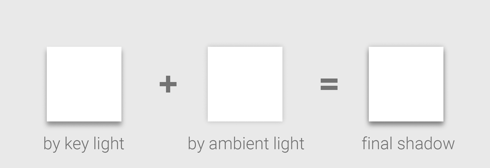

Material Design Toolkit
========================

[](https://travis-ci.org/twang2218/material-design-toolkit)

Welcome to Material Design Toolkit project. This is an implementation of some building blocks of Material Design.

Usage
------

### Requirements

Shadow drawing will require the ```RenderScript```, so, these 2 lines should be added to your project ```build.gradle``` file:

```groovy
android {
    ...
    defaultConfig {
        ...
        renderscriptTargetApi 22
        renderscriptSupportMode true
    }
}
```

Add dependency of the Material Design Toolkit library.

```groovy
dependencies {
    compile 'org.lab99:material-design-toolkit:0.1'
}
```

Palette
--------

The Material Design Toolkit library includes pre-defined material design color palette resource, which are defined by the [Material Design guideline > Style > Color](http://www.google.com/design/spec/style/color.html).



The name format of each color is ```@color/material_COLOR_VARIATION```, 

the ```COLOR``` can be one of
```Javascript
{red, pink, purple, deep_purple, indigo, blue, light_blue, cyan, teal, green, light_green, lime, yellow, amber, orange, deep_orange, brown, grey, blue_grey}
```

the ```VARIATION``` can be one of
```Javascript
{50, 100, 200, 300, 400, 500, 600, 700, 800, 900, a100, a200, a400, a700}
```

However, there is no ```{a100, a200, a400, a700}``` for color ```{brown, grey, blue_grey}```;


To help referencing the variation of each color, there is an array of color for each base color, such as, for Red,

```xml
    <array name="material_red">
        <item>@color/material_red_50</item>
        <item>@color/material_red_100</item>
        <item>@color/material_red_200</item>
        <item>@color/material_red_300</item>
        <item>@color/material_red_400</item>
        <item>@color/material_red_500</item>
        <item>@color/material_red_600</item>
        <item>@color/material_red_700</item>
        <item>@color/material_red_800</item>
        <item>@color/material_red_900</item>
        <item>@color/material_red_a100</item>
        <item>@color/material_red_a200</item>
        <item>@color/material_red_a400</item>
        <item>@color/material_red_a700</item>
    </array>
```

There are also 3 base color array, one for all color, and one for color without accent color, one for the color with accent color. The ```Brown```, ```Grey```, and ```Blue Grey``` don't have accent color variations.
And each item of the array is referenced to those color variation array.

```xml
    <array name="material_color">
        <item>@array/material_red</item>
        <item>@array/material_pink</item>
        <item>@array/material_purple</item>
        <item>@array/material_deep_purple</item>
        <item>@array/material_indigo</item>
        <item>@array/material_blue</item>
        <item>@array/material_light_blue</item>
        <item>@array/material_cyan</item>
        <item>@array/material_teal</item>
        <item>@array/material_green</item>
        <item>@array/material_light_green</item>
        <item>@array/material_lime</item>
        <item>@array/material_yellow</item>
        <item>@array/material_amber</item>
        <item>@array/material_orange</item>
        <item>@array/material_deep_orange</item>
        <item>@array/material_brown</item>
        <item>@array/material_grey</item>
        <item>@array/material_blue_grey</item>
    </array>

    <array name="material_color_with_accent">
        <item>@array/material_red</item>
        <item>@array/material_pink</item>
        <item>@array/material_purple</item>
        <item>@array/material_deep_purple</item>
        <item>@array/material_indigo</item>
        <item>@array/material_blue</item>
        <item>@array/material_light_blue</item>
        <item>@array/material_cyan</item>
        <item>@array/material_teal</item>
        <item>@array/material_green</item>
        <item>@array/material_light_green</item>
        <item>@array/material_lime</item>
        <item>@array/material_yellow</item>
        <item>@array/material_amber</item>
        <item>@array/material_orange</item>
        <item>@array/material_deep_orange</item>
    </array>

    <array name="material_color_without_accent">
        <item>@array/material_brown</item>
        <item>@array/material_grey</item>
        <item>@array/material_blue_grey</item>
    </array>
```


Widgets
-------

### Paper

As described in [Material Design guideline](http://www.google.com/design/spec/what-is-material/environment.html),
material design is inspired by paper and ink. Paper is the building block for any widgets, such as,
Button, Floating Action Button, or Cards.

To create a paper widget, there are a few important features need to be mentioned.

#### Shadow

Paper is existed in a 3D space, paper should have a shadow beneath it, so viewer can get the sense
of the depth between the paper and the background. And as the guideline said, the shadow are composited
by kind of shadow.



The shadow of key light give the sense of the depth, and the shadow of ambient light define the shape
of paper. During the elevation of the paper, the depth is changed, so the shadow of the key light.
However, the shadow of the ambient light will keep the same.

The ```ShadowDrawable``` and ```ShadowRender``` are implemented with the above idea, and the shadow
will be drawn below the widget.

#### Ripple

To response the user's action, the ripple effect will be triggered. That indicators where and what 
the user has been triggered. ```RippleDrawable``` is created to implement the idea. And a ```TouchTracker```
class is created to help to track user's touch location.

#### PaperDrawable

To implement shadow and ripple, an special wrapper drawable, ```PaperDrawable``` is created.
The ```PaperDrawable``` contains 3 layers. From top to bottom, they are:

 * Ripple layer
 * Background layer
 * Shadow layer
 
The ```PaperDrawable``` will be used as the background drawable of ```Paper```, any original background
drawable operations will be redirected to the inner background layer. So, user can specify any drawable
as the background they want, and still get the shadow and ripple effect when they are enabled.

#### Materialize stock widgets

There is a static method ```apply()``` which can be used to materialize the traditional widget, by
wrapping the original background drawable with ```PaperDrawable```, so the widget will have shadow and
ripple.
 
### Button

A ```Button``` is a clickable ```Paper```, normally with a round-cornered background.

### ActionButton

An ```ActionButton``` is a ```Button``` which has round background.

