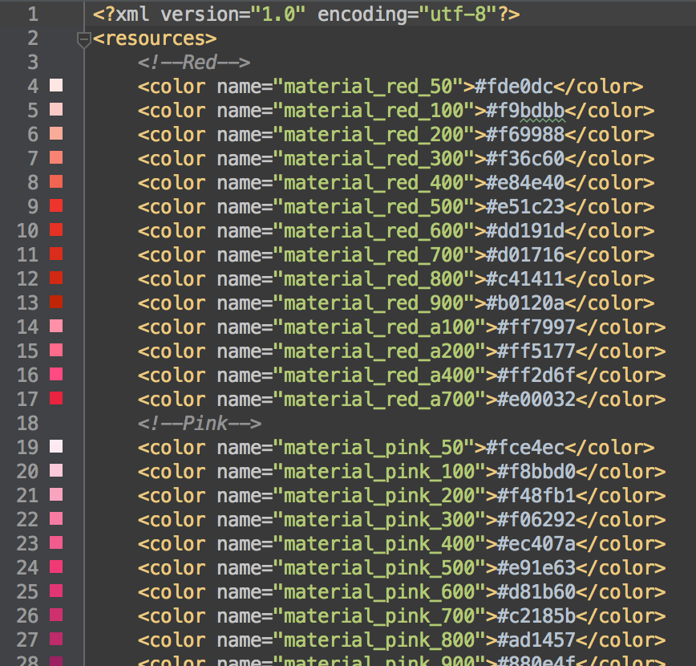

Material Design Toolkit
========================

[](https://travis-ci.org/twang2218/material-design-toolkit)

Implementation of some building blocks of Material Design

Usage
------

### Requirements

Shadow drawing will require the ```RenderScript```, so, these 2 lines should be added to your project ```build.gradle``` file:

```groovy
android {
    ...
    defaultConfig {
        ...
        renderscriptTargetApi 22
        renderscriptSupportMode true
    }
}
```

Add dependency of the Material Design Toolkit library.

```groovy
dependencies {
    compile 'org.lab99:material-design-toolkit:0.1'
}
```

Palette
--------

The Material Design Toolkit library includes pre-defined material design color palette resource, which are defined by the [Material Design guideline > Style > Color](http://www.google.com/design/spec/style/color.html).



To help referencing the variation of each color, there is an array of color for each base color, such as, for Red,

```xml
    <array name="material_red">
        <item>@color/material_red_50</item>
        <item>@color/material_red_100</item>
        <item>@color/material_red_200</item>
        <item>@color/material_red_300</item>
        <item>@color/material_red_400</item>
        <item>@color/material_red_500</item>
        <item>@color/material_red_600</item>
        <item>@color/material_red_700</item>
        <item>@color/material_red_800</item>
        <item>@color/material_red_900</item>
        <item>@color/material_red_a100</item>
        <item>@color/material_red_a200</item>
        <item>@color/material_red_a400</item>
        <item>@color/material_red_a700</item>
    </array>
```

There also are 3 base color array, which each item is referenced to those color variation array.

```xml
    <array name="material_color">
        <item>@array/material_red</item>
        <item>@array/material_pink</item>
        <item>@array/material_purple</item>
        <item>@array/material_deep_purple</item>
        <item>@array/material_indigo</item>
        <item>@array/material_blue</item>
        <item>@array/material_light_blue</item>
        <item>@array/material_cyan</item>
        <item>@array/material_teal</item>
        <item>@array/material_green</item>
        <item>@array/material_light_green</item>
        <item>@array/material_lime</item>
        <item>@array/material_yellow</item>
        <item>@array/material_amber</item>
        <item>@array/material_orange</item>
        <item>@array/material_deep_orange</item>
        <item>@array/material_brown</item>
        <item>@array/material_grey</item>
        <item>@array/material_blue_grey</item>
    </array>

    <array name="material_color_with_accent">
        <item>@array/material_red</item>
        <item>@array/material_pink</item>
        <item>@array/material_purple</item>
        <item>@array/material_deep_purple</item>
        <item>@array/material_indigo</item>
        <item>@array/material_blue</item>
        <item>@array/material_light_blue</item>
        <item>@array/material_cyan</item>
        <item>@array/material_teal</item>
        <item>@array/material_green</item>
        <item>@array/material_light_green</item>
        <item>@array/material_lime</item>
        <item>@array/material_yellow</item>
        <item>@array/material_amber</item>
        <item>@array/material_orange</item>
        <item>@array/material_deep_orange</item>
    </array>

    <array name="material_color_without_accent">
        <item>@array/material_brown</item>
        <item>@array/material_grey</item>
        <item>@array/material_blue_grey</item>
    </array>
```


Widgets
-------

 * Paper
 * Button
 * ActionButton


